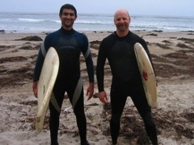

Circuitscape was originally written by [Brad McRae](http://www.nature.org/science-in-action/our-scientists/brad-mcrae.xml) and Viral Shah. Tanmay Mohapatra did most of the heavy lifting for the new [4.0 release](http://www.circuitscape.org/downloads).  Brad is an Ecologist with the Nature Conservancy's North America Region. He works on habitat connectivity conservation, climate change adaptation, and landscape genetics.Viral, along with three other colleagues, created the Julia programming language ([http://www.julialang.org](http://www.julialang.org/)). He spends his time between hacking Julia and working on public policy. anmay is a software programmer and open source enthusiast. He contributes  to Circuitscape and Julia development. Circuitscape v5 is developed and maintained by [Ranjan Anantharaman](https://ranjanan.github.io/).

