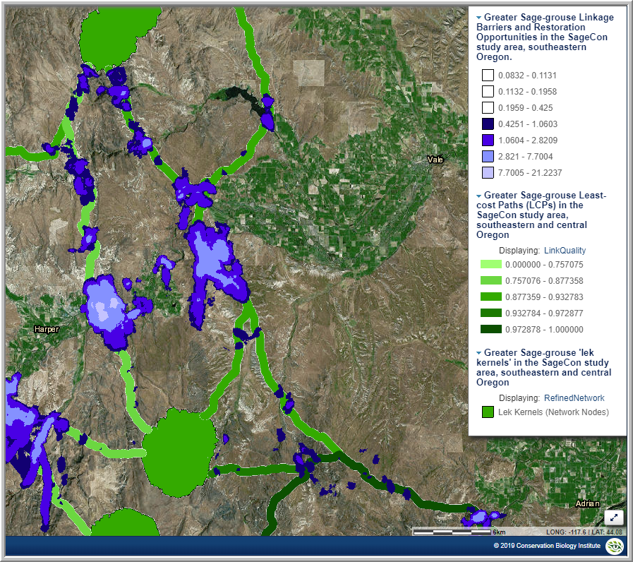

### **Linkage Pathways Tool**

The primary and original tool in the Linkage Mapper toolbox is Linkage Pathways. (Originally, the Linkage Pathways tool was informally called “Linkage Mapper”, and formally called the “Build Network and Map Linkages” tool.) Linkage Pathways uses GIS maps of core habitat areas and resistances to identify and map linkages between core areas. Each cell in a resistance map is attributed with a value reflecting the energetic “cost”, (i.e. difficulty and mortality risk) of moving across that cell. Resistance values are typically determined by cell characteristics, such as land cover or housing density, combined with species-specific landscape resistance models. As animals move away from specific core areas, cost-weighted distance analyses produce maps of total movement resistance accumulated. The Linkage Pathways tool uses ArcGIS and Python scripts to identify adjacent (neighboring) core areas and creates maps of least-cost corridors between them. It then mosaics the individual corridors to create a single composite corridor map. The result shows the relative value of each grid cell in providing connectivity between core areas, allowing users to identify which routes encounter more or fewer features that facilitate or impede movement between core areas. Linkage Pathways also produces vector layers that can be queried for corridor statistics [(McRae & Kavanagh 2011)](https://paperpile.com/c/f97yev/9jQPB). Linkage Pathways output and Habitat Concentration Areas (HCAs) for white-tailed jackrabbit (Lepus townsendii). (Mount hood, Oregon, is in the top left corner) [Link here for the Interactive Map.](https://databasin.org/maps/342bc86a67984c2892e56fdf6a8befd4/active) 

### **Climate Linkage Mapper**

This tool can be thought of as the “Climate-Traversing Linkage Pathways Tool.”  It fine tunes the routes of mapped linkages between core areas such that they minimize the range of micro-climates (e.g. temperatures, or climatic water difference) that are encountered along the linkage. Consider the example of two mountain ridges on the east and west of a hot valley, and joined together at the north end, to make a U-shape.  Climate linkage mapper will suggest that the linkage from a core on one ridge to a core on the other is traversing along the ridgelines, connecting at the north, rather than the traditional least cost corridor that ignores climate ranges and goes down into the hot valley and then back up the other side [(Kavanagh et al. 2012)](https://paperpile.com/c/f97yev/Ktrz).  This increases the likelihood that the mapped linkage is the one actually used by wildlife, especially by climate sensitive wildlife. Also, the only linkages mapped are those that meet a user-defined climatic difference threshold between the two cores. (This feature is also included now in the Linkage Priority tool, where you also have the option of including linkages connecting similar climates, and just giving them a lower conservation priority value.) See Littlefield et al. [(2017)](https://paperpile.com/c/f97yev/ApMA/?noauthor=1) and Nuñez et al. [(Nuñez et al. 2013)](https://paperpile.com/c/f97yev/SM3q) for more details on the use of the Climate Linkage mapper tool in connectivity modelling. Climate Linkage Mapper output for whitebark pine, in the transboundary region between Washington and British Columbia. Note, Linkage Mapper can model connectivity for plants as well as animals. [Link here to the Interactive Map.](https://nplcc.databasin.org/maps/859e97aa40034b868f0de21de0d519a0/active) 

### **Pinchpoint Mapper**

Once corridors have been mapped using Linkage Pathways, or Climate Linkage Mapper, Pinchpoint Mapper utilizes circuit theory to run Circuitscape [(McRae & Shah 2009)](https://paperpile.com/c/f97yev/hP2QF) within the resulting corridors. This produces current-maps that identify and map pinch points (i.e., constrictions or bottlenecks) within the linkages [(McRae 2012a)](https://paperpile.com/c/f97yev/3RNsw). [(McRae 2012a)](https://paperpile.com/c/f97yev/3RNsw). More details on circuit theory and on Circuitscape software can be found in McRae et al. [(2008)](https://paperpile.com/c/f97yev/MgVqV/?noauthor=1) and McRae and Shah [(2009)](https://paperpile.com/c/f97yev/hP2QF/?noauthor=1).  Pinch points represent areas where movement would be funneled and thus may be particularly important to keeping intact.  Even a small loss of area in these pinch points would disproportionately compromise connectivity [(Castilho et al. 2015)](https://paperpile.com/c/f97yev/DscGZ).  Pinchpoint mapper output and Habitat Concentration Areas (HCAs) for white-tailed jackrabbit (Lepus townsendii). [Link here for the Interactive Map.](https://databasin.org/maps/2147e6fa4419481f803ff916b5cd7b9f/active) 

### **Barrier Mapper**

Once linkages are created using the Linkage Pathways tool, or Climate Linkage Mapper, Barrier Mapper quantifies the importance of “barriers” that affect the quality and/or location of the corridors [(McRae 2012c)](https://paperpile.com/c/f97yev/t3cy).  The term “barriers” is used in a general way and includes portions of a landscape that are difficult to pass through for wildlife, but are not barriers in the formal sense of the term. In essence, they identify areas for restoration and mitigation. Much more detail is provided in a publication by McRae et al. [(2012)](https://paperpile.com/c/f97yev/nTRR/?noauthor=1).  "Lek Kernals" (i.e. HCAs) for greater sage grouse as well as linkages, linkage barriers, and restoration opportunities [Link here for the Interactive Map,](https://databasin.org/maps/c897306da2d94c558fbe8bc79e93a035/active) ...[and Gallery derived from Jones 2015](https://databasin.org/galleries/843cdce2d4fc419da0d4587950c20de2)

### **Centrality Mapper**

Once corridors have been mapped using Linkage Pathways or Climate Linkage Mapper, Centrality Mapper analyzes the resulting linkage networks, calculating “current flow centrality” across the networks [(McRae 2012b)](https://paperpile.com/c/f97yev/N31oa). Current flow centrality is a measure of how important a linkage is for keeping the overall network connected.  It utilizes Circuitscape to implement this circuit theory approach. According to Dutta et al. [(2015)](https://paperpile.com/c/f97yev/4kf3/?noauthor=1) Centrality Mapper treats each core as a “node”, each linkage as a single resistor, and assigns a resistance equal to the cost-weighted distance of the corresponding least-cost corridor. It then iterates through all core area pairs, injecting 1 amp of current into one core area and setting the other to ground. It then adds up current flow for each core and linkage to generate a map of cumulative current flow, indicating the importance of each linkage in maintaining connectivity across the entire network of cores, and can be considered as a measure of linkage and core centrality.  

Centrality of Linkages and Habitat Concentration Areas (HCAs) for white-tailed jackrabbit (Lepus townsendii). [Link here for the Interactive Map.](https://databasin.org/maps/fbf173ac249e4f689d095b2696b3c923/active)

### **Linkage Priority Tool** (New in v2.0)

The Linkage Priority Tool was implemented to help quantify the relative conservation priority of each linkage in a landscape. Linkage Priority Tool is based on weighted combinations of many factors (Diagram 1). The lower set of factors in the diagram estimate the relative value of the two cores at either end of a linkage. Core priority is is evaluated on the shape, mean resistance value, size, and expert opinion. Users can also include climate by giving a higher value to cores with higher potential to serve as climate refugia. The Tool calculates relative value for every core, and the average value of the two cores associated with each linkage. This then becomes one of the factors determining linkage priority. Hence, a linkage which connects two really important core areas is a higher conservation priority than one that connects two marginal core areas.   The average core area value of the two cores of a linkage is then combined with the other higher level factors  that relate directly to linkage priority, including the permeability of each linkage (i.e., the mean resistance values along the least cost path), the proximity of the two cores, the centrality, and expert opinion if available. Users can also include climate signature difference between two cores, giving higher priority to linkages that span a climate gradient, facilitating species range shifts. The tool provides the option of using the difference between the current climate signature of the cooler core, and the future climate signature of the hotter core, to simulate the climate gradient that slow moving species will encounter. (See below figure). A detailed user guide is provided online [(Gallo & Greene 2018)](https://paperpile.com/c/f97yev/fPPHe). Additional details will be presented at the North American Congress of Conservation Biology (2018). Diagram 1: Conceptual diagram of the Linkage Priority Tool. Optional climate wise features have a dashed line.   

### **Synthesis of Tool Outputs**

The Linkage Priority Tool has been applied in eight regions, and in each case, combined with several other Linkage Mapper tool outputs to create synthesis products. Three of these regions are reported on in Gallo et al. (2019) and several are in reports in review. They synthesised the products for focal species, for structural connectivity, and also perfomred a metasyntheis of focal species and structural connectivity syntheses. The American Badger example is shown below. Linkage Priority output combined with Linkage Pathways and Pinchpoint Mapper outputs.  This provides an estimate of connectivity conservation priorities for American badger (Taxidea taxus), in the Sacramento Valley. Core areas are in grey, with relative core area value mapped (Gallo et al. 2019). [Link here for the Interactive Map.](https://databasin.org/maps/a79bb15434a24871ba70bdf68e5c7249/active) In this report, climate was considered in three ways in determining priority: (1) quantifying which linkages best facilitated long-term species range shifts, (2) which core areas provided more projected climate stability, and (3) which core areas contained more climate micro-refugia for withstanding climate change. In a report under review, Barrier Mapper output is combined with outputs from Linkage Priority, Pinchpoint Mapper, and Linkage Pathways to map the connectivity restoration priorities of a region. An American badger on the move (photo by James Maughn)

### **References**

Castilho CS, Hackbart VCS, Pivello VR, dos Santos RF. 2015. Evaluating Landscape Connectivity for Puma concolor and Panthera onca Among Atlantic Forest Protected Areas. Environmental management 55:1377–1389. <http://dx.doi.org/10.1007/s00267-015-0463-7>

Dutta T, Sharma S, McRae BH, Roy PS, DeFries R. 2015. [Connecting the dots: mapping habitat connectivity for tigers in central India.](http://link.springer.com/article/10.1007/s10113-015-0877-z) Regional Environmental Change 16:53–67. Springer Berlin Heidelberg.

Gallo JA, Greene R. 2018. Connectivity Analysis Software for Estimating Linkage Priority. Conservation Biology Institute, Corvallis, OR. <http://dx.doi.org/10.6084/m9.figshare.5673715>

Gallo, JA, J. Strittholt, G. Joseph, H. Rustigian-Romsos, R. Degagne, J. Brice, and A. Prisbrey.2019. Mapping Habitat Connectivity Priority Areas that are Climate-wise and Multi-scale,for Three Regions of California. Conservation Biology Institute. March. <https://doi.org/10.6084/m9.figshare.7477532>

Jones, A. 2015. [Mapping Habitat Connectivity for Greater Sage-Grouse in Oregon’s Sage-Grouse
Conservation Partnership (SageCon) Assessment Area.](https://databasin.org/documents/documents/914b7516f6b042fab105117d318eb702/download/) Produced by The Nature Conservancy (Portland OR) in
partial fulfillment of BLM Cooperative Agreement L12AC20615

Kavanagh DM, Nuñez TA, McRae BH. 2012. Climate linkage mapper connectivity analysis software. The Nature Conservancy, Seattle WA. Available from <http://www.circuitscape.org/linkagemapper>.

Littlefield CE, McRae BH, Michalak JL, Lawler JJ, Carroll C. 2017. [Connecting today’s climates to future climate analogs to facilitate movement of species under climate change.](http://dx.doi.org/10.1111/cobi.12938) Conservation Biology: the Journal of the Society for Conservation Biology 31:1397–1408. 

McRae BH. 2012a. Pinchpoint Mapper Connectivity Analysis Software. The Nature Conservancy, Seattle, WA. Available from <http://www.circuitscape.org/linkagemapper>

McRae BH. 2012b. Centrality Mapper Connectivity Analysis Software. The Nature Conservancy, Seattle WA. Available from <http://www.circuitscape.org/linkagemapper> 

McRae BH. 2012c. Barrier Mapper Connectivity Analysis Software. The Nature Conservancy, Seattle, WA.  Available from <http://www.circuitscape.org/linkagemapper>

McRae BH, Dickson BG, Keitt TH, Shah VB. 2008. [Using circuit theory to model connectivity in ecology, evolution, and conservation.](https://www.ncbi.nlm.nih.gov/pubmed/18959309) Ecology 89:2712–2724. 

McRae BH, Hall SA, Beier P, Theobald DM. 2012. [Where to restore ecological connectivity? Detecting barriers and quantifying restoration benefits.](http://dx.doi.org/10.1371/journal.pone.0052604) PloS one 7:e52604. journals.plos.org. 

McRae BH, Kavanagh DM. 2011. Linkage Mapper Connectivity Analysis Software. The Nature Conservancy, Seattle, WA. Available from <http://www.circuitscape.org/linkagemapper.>

McRae B, Shah V. 2009. Circuitscape User Guide. University of California, Santa Barbara. Available from: <http://www.circuitscape.org>

Nuñez TA, Lawler JJ, McRae BH, Pierce DJ, Krosby MB, Kavanagh DM, Singleton PH, Tewksbury JJ. 2013. [Connectivity planning to address climate change.](http://dx.doi.org/10.1111/cobi.12014) Conservation Biology: the Journal of the Society for Conservation Biology 27:407–416. Wiley Online Library. 

Note: Most, if not all of these are available to Linkage Mapper users as .pdfs, upon request.

.
